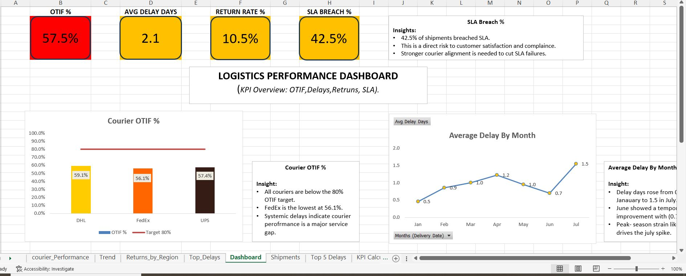

# Logistics Performance Dashboard

Excel-based logistics performance analysis with KPIs, visualizations, and insights (OTIF, delays, returns, SLA).

---

## 📊 Project Overview
This project tracks key logistics metrics to highlight performance gaps and areas for improvement.  
The dashboard was built in Excel using PivotTables, helper tables, and custom visualizations.  

### Key KPIs:
- **OTIF % (On Time In Full)**  
- **Average Delay Days**  
- **Return Rate %**  
- **SLA Breach %**

---

## 📸 Dashboard Preview

---

## 🔑 Features
- KPI cards for a quick overview of logistics performance  
- Courier OTIF% % benchmarked against an 80% target (using helper table)  
- SLA breach % to monitor compliance risk  
- Return rate by region with benchmark line  
- Top 5 delayed shipments, showing couriers and regions impacted  
- Trend line of average delays by month to identify seasonality  

---

## 📂 Files in this Repository
- **Logistics Dashboard sheet.xlsx** → Excel file with dataset, helper tables, and dashboard  
- **Logistics Performance Project Documentation.pdf** → Detailed documentation of methodology and insights  
- **Dashboard_Screenshot.JPG** → Preview of the dashboard  
- **README.md** → Project summary and instructions  

---

## 📌 Insights
- **OTIF**: All couriers perform below the 80% target, with FedEx lowest at 56.1%  
- **SLA**: 42.5% of shipments breached SLA, posing a risk to compliance and customer satisfaction  
- **Delays**: Average delays rise in July, indicating seasonal or capacity-driven issues  
- **Returns**: EMEA region has the highest return rate (42.9%), pointing to supplier or product quality concerns  

---

## 🚀 How to Use
1. Open the Excel file `Logistics Dashboard sheet.xlsx`  
2. Explore the KPI cards and charts on the **Dashboard** sheet  
3. Use slicers/filters (where applicable) to drill into courier, region, or time period  
4. Refer to the PDF documentation for methodology and detailed insights  

---

## 📖 About
This project was created to demonstrate data-driven supply chain performance tracking using Excel.  
It can be adapted for real-world logistics operations to monitor KPIs and guide decision-making.  
